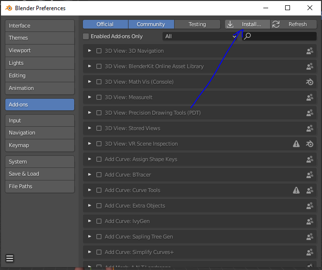

# Tuto Raylib/Blender/Mixamo

Hello ! Apres un rapide regard au sujet, je vois que l'implémentation des animations sur **Raylib** peut être un peu coton. Je me suis penché sur la question, et je vous propose un rapide tuto pour vous expliquer comment télécharger une animation sur **Mixamo**, l'importer sur **Blender**, et l'exporter dans un format accepté par **Raylib**.

# Mixamo
https://www.mixamo.com/#/

Ce site propose de nombreuses animations 3D gratuites, libres au téléchargement.

Recherchez l'animation qui vous intéresse :

Cliquez sur le resultat, observez l'animation se jouer à droite.
Si vous êtes satisfait de votre recherche, vous allez pouvoir télécharger l'animation :

Cliquez donc sur ce bouton download, vous devriez voir apparaître la fenêtre de dialogue suivante :

Ne changez rien, et appuyez sur le bouton "Download".

# Blender

Blender est un éditeur 3D gratuit et open-source, vous pouvez l'obtenir ici :

https://www.blender.org/

Une fois téléchargé et installé, lancez Blender :

Supprimez le cube (cliquez dessus, et appuyez sur Suppr), puis importez votre animation nouvellement acquise :

Vous devez ensuite reset l'échelle à son format original. Pour ce faire, il vous suffit de cliquer sur "Armature" d'appuyer sur ALT + S :

Ensuite, vous devez installer un addon qui permettra à Blender d'exporter votre objet et son animation dans un format qui convient à Raylib. Rendez-vous donc sur ce **GitHub** :

https://github.com/lsalzman/iqm

Et cliquez ici :

Une fois dans ce dossier, téléchargé le fichier python qui s'y trouve :

Une fois cette opération terminée, revenons à Blender. Il faut maintenant installer l'addon. Pour ce faire, cliquez sur Edit > Preferences :

Cliquez ensuite sur "Install" comme indiqué ici :

Dans la fenêtre qui s'ouvre, trouvez le fichier python que vous venez de télécharger, puis cliquez sur "Install Addon" :

Ensuite, si il n'apparaît pas de suite, cherchez "iqm" dans la barre de recherche, et assurez vous de cocher l'addon "Import-Export: Export Inter-Quake Model (.iqm/.iqe)" :

Vous pouvez ensuite exporter le modèle en **.iqm** :

Il vous faudra faire deux exports pour que cela fonctionne avec Raylib. Le premier se fait comme ci-dessous. Il ne **FAUT PAS CHANGER LES SETTINGS A DROITE** pour le premier export :

Une fois que c'est fait, on arrive sur la partie à peine plus technique : l'export de l'animation. Pour cela il va falloir changer le nom de l'animation dans **l'architecture d'objet Blender**. Déroulez "Armature" > "Animation" et changer le nom "mixamo[...]" par le nom que vous souhaitez donner à votre animation :

Ensuite cliquez sur l'icône indiqué par la flèche de gauche sur l'image ci-dessous, qui fera pop le menu suivant, puis cliquez sur "Dope Sheet" :

Sur la nouvelle fenêtre ouverte, scrollez vers la droite afin de trouver la dernière **keyframe** de votre animation (comme vous le voyez ici, votre animation est représentée par un trait vert sur lequel se trouve des points jaunes, qui représentent les keyframes). Notez le numéro de votre dernière keyframe (ici 372) :

Vous allez maintenant pouvoir exporter l'animation. Il faut pour cela répéter la procédure de l'export du **.iqm** précédent. Une fois que vous avez cliqué sur "File" > "Export" > ".iqm", il va falloir changer le nom du fichier (souvent le nom du modèle exporté + "Animation" ou "Anim"), puis ajouter la ligne indiquée par la flèche de droite selon le format suivant : NOM DE L'ANIMATION QUE VOUS AVEZ CHANGE:FRAME DE DEBUT DE L'ANIMATION (toujours 1):FRAME DE FIN DE L'ANIMATION COMME RECUP AU DESSUS:FRAMES PAR SECONDE (je vous conseille 30):1 POUR QUE VOTRE ANIMATION LOOP, 0 SINON
Le **séparateur** entre chacun de ses éléments est un **":"** (exemple ci-dessous) :

# Raylib

Maintenant que vos fichiers sont prêts, voici comment les utiliser avec Raylib.
Rendez-vous sur le site de **Raylib** :

https://www.raylib.com/

Cliquez sur "Examples" puis "Models" puis sur l'animation avec le bonhomme jaune :

Ce code se trouve dans le fichier "**models_animation.c**" dans les exemples qui sont dans le dossier **raylib/examples/models** obtenu après le DL de raylib. Dans ce code, remplacez le path indiqué par **1** par celui vers le fichier model (GangNam.iqm), commentez les lignes indiquées par les flèches, et remplacez le path indiqué par **2** par celui vers le ficher animation (GangNamAnimation.iqm) :

Une fois que ça c'est fait, compilez le tout (la méthode dépend de votre installation, référez-vous à la doc de l'install Raylib !), puis lancez le binaire **models_animation**. Vous obtiendrez la fenêtre suivante, mais pas de panique, c'est juste ultra zoomé :

Dézoomez en scrollant avec votre pad, et voilà :

Aaaand ... done ! Vous n'avez plus qu'à rester appuyer sur espace pour voir votre animation se jouer !
A vous de compléter ce tuto avec le reste (typiquement... une texture) !

Bon courage, j'espère que ça vous aidera !
